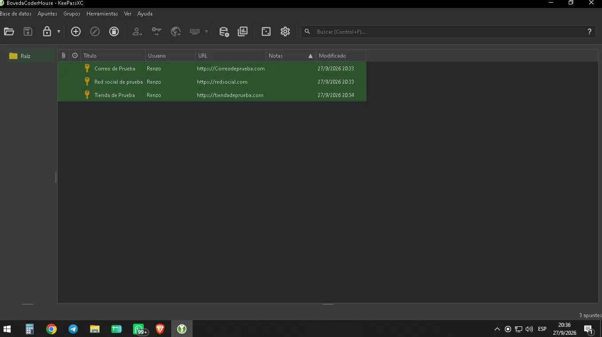
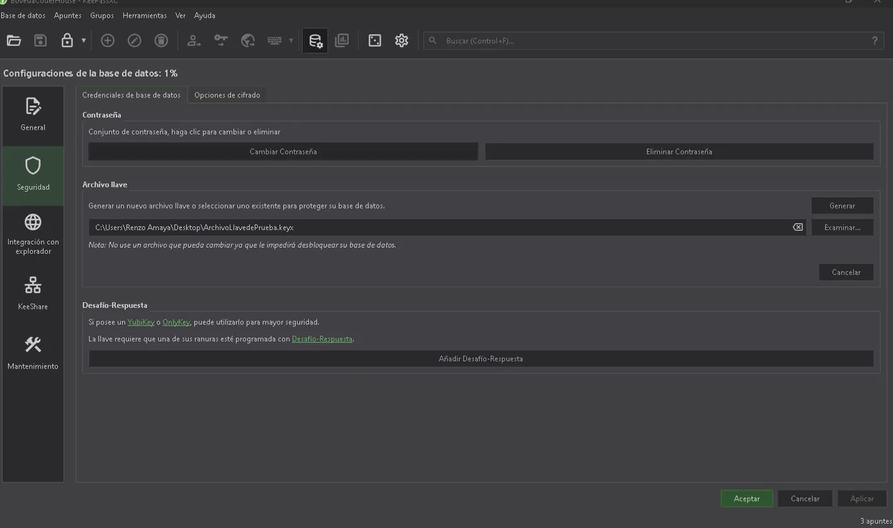
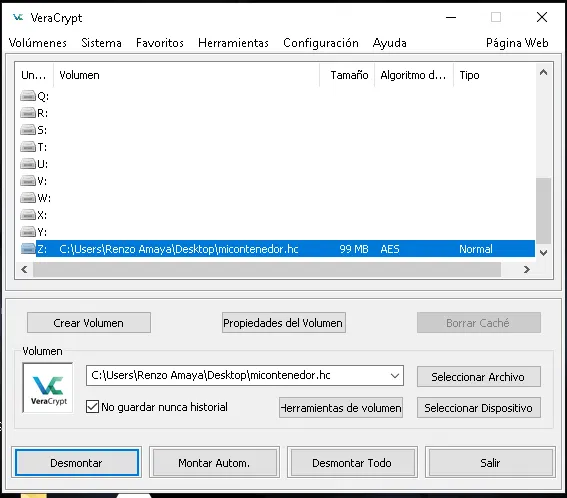

# Mi Bóveda y Contenedor Seguro Fundamental

Práctica de Gestión de Identidad (gestor de contraseñas + MFA) y Cifrado de Datos (VeraCrypt).

## Herramientas utilizadas

- **Gestor de contraseñas:** KeePassXC
- **Cifrado de contenedor:** VeraCrypt

## Paso 1 — Bóveda de Identidad

- Base de datos creada en KeePassXC ("BovedaCoderHouse") con contraseña maestra tipo frase de contraseña.
- 3 entradas de ejemplo cargadas (Correo de Prueba, Red social de prueba, Tienda de Prueba), con contraseñas de 16+ caracteres generadas con el generador de KeePassXC.
- Protección adicional activada: Archivo Llave (Key File) configurado en Base de datos → Configuración → Seguridad.

**Captura 1 — Lista de cuentas guardadas:**

**Captura 2 — Panel de seguridad con el Archivo Llave activado:**

## Paso 2 — Contenedor Cifrado con VeraCrypt

- Volumen estándar creado (`micontenedor.hc`), tamaño 99 MB.
- Algoritmo de cifrado por defecto: AES.
- Contraseña del contenedor distinta a la del gestor de contraseñas.

**Captura 3 — VeraCrypt con el volumen montado (letra de unidad Z:):**

## Paso 3 — Uso y documentación

Dentro de la unidad `Z:` montada se creó `aprendizajes.txt` con tres aprendizajes clave de la unidad:

1. Un gestor de contraseñas (KeePassXC) elimina la necesidad de reutilizar o memorizar contraseñas débiles: genera y guarda claves largas y aleatorias, protegidas por una contraseña maestra y, opcionalmente, un archivo llave adicional.
2. El MFA (autenticación multifactor) agrega una segunda barrera de seguridad: aunque un atacante robe mi contraseña (algo que sé), no puede acceder sin el segundo factor (algo que tengo, como el teléfono o un archivo llave).
3. VeraCrypt permite crear contenedores cifrados donde los archivos quedan completamente ilegibles sin la contraseña correcta; al desmontar el volumen, la unidad desaparece del explorador y los datos vuelven a estar protegidos, aunque alguien tenga acceso físico a la computadora.

El volumen fue desmontado ("Dismount") al finalizar, desapareciendo de la unidad Z: del explorador de archivos. La contraseña del contenedor VeraCrypt quedó guardada dentro de la bóveda de KeePassXC.

## Notas de seguridad

- Las contraseñas reales nunca se muestran en las capturas.
- La contraseña de VeraCrypt fue guardada en KeePassXC antes de cerrar el volumen (no hay recuperación posible si se pierde).

## Nota adicional sobre las capturas

Tanto KeePassXC como VeraCrypt (desde su versión 1.26.24) incluyen por defecto una protección anti-capturas de pantalla, pensada para bloquear herramientas como Windows Recall o software espía que registre la pantalla. Para tomar las capturas de este ejercicio fue necesario:
- En KeePassXC: activar temporalmente "Allow Screen Capture" desde el menú Vista.
- En VeraCrypt: desactivar temporalmente la opción en Configuración → Rendimiento/Configuración del controlador (requiere permisos de administrador y reiniciar Windows).
